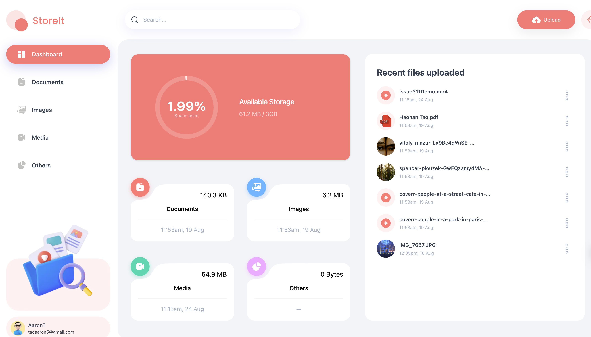

# 🚀 Storage It All

🎬[Live Demo](https://all-storage.vercel.app/)

AllStorage is a modern, full-featured storage management and file sharing platform that allows users to upload, organise, and share files effortlessly. Built with Next.js 15, TypeScript, TailwindCSS, and Appwrite, it features secure passwordless authentication via email OTP, real-time data management, and a modular, maintainable architecture designed for both personal use and enterprise-level storage solutions.

With a scalable codebase, responsive interface, and clean UI/UX, AllStorage provides a seamless, secure, and highly interactive experience, making it ideal for developers exploring the code, users managing files, or teams collaborating in real-world applications.

---

<p align="center">
  
</p>


## Table of Contents

- [Description](#description)
- [Features](#features)
- [Demo](#demo)
- [Technology Stack](#technology-stack)
- [Project Structure](#project-structure)
- [Getting Started](#getting-started)
- [Deployment ](#deployment)
- [Contributing](#contributing)
- [Contact](#contact)
- [License](#license)

---

## 📝Description

### What the project does

- Upload, organise, and share files securely.
- Manage storage efficiently with real-time updates.
- Collaborate with team members on shared files.

### Key highlights or advantages

- Passwordless authentication via email OTP powered by Appwrite.
- Built with Next.js 15, TypeScript, and TailwindCSS for a modern, responsive interface.
- Modular and scalable architecture suitable for personal or enterprise use.
- Clean UI/UX optimised for usability and performance.

### Goals and user value

- Provide a seamless and secure file storage experience.
- Make file management intuitive and efficient.
- Enable real-time collaboration and easy sharing.
- Demonstrate best practices in full-stack web development for developers.

---

## ⚡Features

| Feature                        | Description                                                  |
| ------------------------------ | ------------------------------------------------------------ |
| 🔑 Authentication               | Passwordless login via Appwrite email OTP. <details><summary>More</summary>Easy signup, login, and logout with minimal friction. User sessions are safely managed with token-based authentication.</details> |
| 📂 File Management              | Upload and manage various file types. <details><summary>More</summary>Rename, delete, or preview files directly in the browser. Real-time storage updates and file count tracking.</details> |
| 🔗 File Sharing & Collaboration | Share files securely with other users or teams. <details><summary>More</summary>Manage permissions for collaborative access. Supports real-time collaboration and easy file discovery.</details> |
| 📊 Dashboard & Analytics        | Visual overview of storage usage and recent uploads. <details><summary>More</summary>Summary of files grouped by type, size, or date. Quick insights into shared content and activity logs.</details> |
| 🔍 Search & Sorting             | Find and sort files quickly. <details><summary>More</summary>Global search across the platform. Sorting options by name, date, or file size, optimized for fast performance with large datasets.</details> |
| 🖥️ Responsive Design            | Works on all devices. <details><summary>More</summary>Modern, minimalist UI built with TailwindCSS. Fully responsive across desktop, tablet, and mobile. Intuitive interface for both individual and team use.</details> |

Include screenshots:

<p align="center">
  
</p>
<p align="center">
  
</p>
<p align="center">
  
</p>
<p align="center">
  
</p>

[Live Demo Link](#)

---

## ⚙️Technology Stack

### Frontend

- **Frameworks / Libraries:** Next.js 15, React 19
- **Styling / UI libraries:** TailwindCSS, ShadCN
- **State management tools:** React Context, Zustand (if used)

### Backend

- **Server / API frameworks:** Appwrite Node SDK
- **Database:** Appwrite Database (Cloud / Collections)
- **Authentication / Authorization:** Appwrite Email OTP (passwordless)

### Additional Tools

- **File storage & management:** Appwrite Storage
- **Deployment platforms:** Vercel, Appwrite Cloud

---

## 🗂️Project Structure

AllStorage/
 │
 ├─ app/         						       # Next.js app routes and pages 
 ├─ components/					      # Reusable React components
 │   └─ ui/									# Shadcn-UI components
 ├─ hooks/									 # Custom React hooks
 ├─ constants/							   # Global constants
 │   └─ index.ts
 ├─ libs/										  # Utility functions and SDK wrappers
 ├─ public /									 # Static assets like images, icons
 ├─ types/									   # TypeScript types
 ├─ node_modules
 ├─ .env.local 								 # Environment variables
 ├─ package.json 
 ├─ tsconfig.json 
 ├─ tailwind.config.ts 
 ├─ next.config.ts 
 └─ components.json      

## Getting Started

Follow these steps to set up **AllStorage** on your local machine.

Make sure you have the following installed:

- [Node.js](https://nodejs.org/en/) (v18+ recommended)
- [npm](https://www.npmjs.com/) or yarn
- [Git](https://git-scm.com/)

### **Clone the Repository**

```bash
git clone https://github.com/HAONANTAO/AllStorage.git
cd AllStorage
```

### **Install Dependencies**

Using npm:

```
npm install
```

### **Set Up Environment Variables**

Create a `.env.local` file in the root directory and add your Appwrite credentials:

```bash
NEXT_PUBLIC_APPWRITE_ENDPOINT="https://cloud.appwrite.io/v1"
NEXT_PUBLIC_APPWRITE_PROJECT="YOUR_PROJECT_ID"
NEXT_PUBLIC_APPWRITE_DATABASE="YOUR_DATABASE_ID"
NEXT_PUBLIC_APPWRITE_USERS_COLLECTION="YOUR_USERS_COLLECTION"
NEXT_PUBLIC_APPWRITE_FILES_COLLECTION="YOUR_FILES_COLLECTION"
NEXT_PUBLIC_APPWRITE_BUCKET="YOUR_BUCKET_ID"
NEXT_APPWRITE_KEY="YOUR_APPWRITE_KEY"
```

Replace the placeholders with your actual Appwrite project values.

### **Run the Project**

Start the development server:

```bash
npm run dev
```

Open http://localhost:3000 in your browser to see the app.

## ☁️Deployment

You can deploy **AllStorage** to any platform that supports Next.js, such as **Vercel** or **Netlify**.

### **Vercel Deployment**

1. Connect your GitHub repository to Vercel.
2. Set the environment variables in Vercel’s dashboard.
3. Deploy the project; it will automatically build and launch.

Your live app will be available at `https://your-project-name.vercel.app`.

## 🤝Contributing

Contributions are welcome!

1. Fork the repository
2. Create a new branch (`git checkout -b feature/your-feature`)
3. Make your changes and commit (`git commit -m 'Add new feature'`)
4. Push to the branch (`git push origin feature/your-feature`)
5. Open a Pull Request

Please follow the coding style and include descriptive commit messages.

------

## 📫Contact

- **Author:** HAONAN Tao
- **GitHub:** https://github.com/HAONANTAO
- **Email:** taoaaron5@gmail.com

------

## 📄License

This project is licensed under the MIT License. 